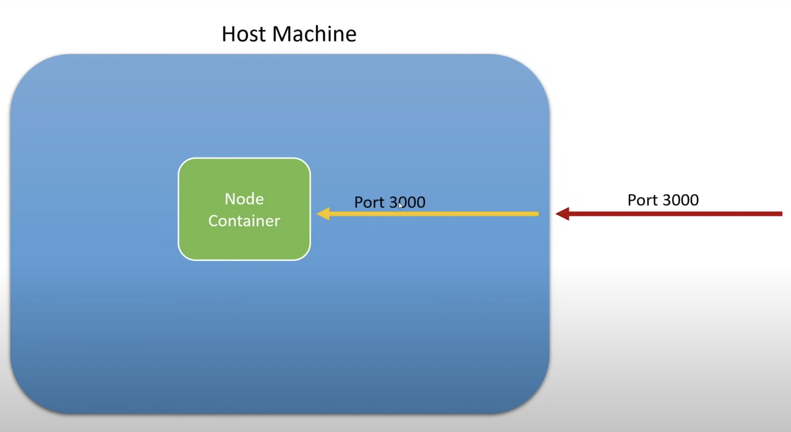

# Docker with Nodejs Development

## Table of Content 

- [Docker Set up]()
- [Docker Image](#create-custom-image)
- [Running Image](#runing-docker-image)
- [Docker Port Mapping](#docker-port-mapping)
- [Volum Hack](#anonymous-volumes-hack)
- [Read Only bind Mount](#read-only-bind-mounts)
- [Environment variables](#environment-variables)
- [Delete Volume](#deleting-stale-volumes)
- [Docker compose](#docker-compose)
- [Development Vs Production](#development-vs-production)
---

## Create Custom Image

1. Create docker file


```sh
#Dockerfile
FROM node:15
WORKDIR /app
COPY package.json .
RUN npm install
COPY . ./
```
2. Build docker image
- docker file must be in the same level of directory where we run the command line. 
```
$ docker build .
```
- run docker image  with tags  (-t name)
```
$ docker build -t node-app-image .
```

- check image list
``` 
$ docker image ls
```

## Runing docker image 
- run the docker image we just created

```sh
$ docker run (image name or id)
```
Example
```sh
$ docker run node-app-image
```
### runing docker image with custom name

```sh
$ docker run -d --name node-app node-app-image
```

### check runing containers

```sh
$ docker ps
```

### stop runing containers with id
```sh
$ docker stop ca7869d71b32(container_id)
```

### delete container with id
```sh
$ docker rm ca7869d71b32 (container Id or name) -f
```

## Docker PORT Mapping

- p ``` -p 4000:3000 ```

- application port is :3000

- docker container port is :4000

- Map TCP port 3000 in the container to port 4000 on the Docker host. (Local machine).

- ```-p 8080:80```	
- Map TCP port 80 in the container to port 8080 on the Docker host.


Set up docker container port
- `EXPORT 3000`
```
FROM node:15
WORKDIR /app
COPY package.json .
RUN npm install
COPY . ./
EXPORT 3000
```


Example
```sh
docker run -p 3000:3000 -d --name node-app  node-app-image
```


---
##  runing interactive mode into docker container

```sh
$ docker exec -it node-app bash
```

## add docker ignore file

```
node_modules
Dockerfile
.dockerignore
.git
.gitignore
images/
README.md
```

---

## Syncing source code with bind mounts

## Anonymous Volumes hack

- To get most updated code from local to docker container

1. Create  docker volume
    - local source code are syncing into this volume in docker.

2. volume type bind mounts

- `-v pathToFolderOnLocation:pathToFolderOnContainer`

```sh
$ docker build -v /Users/isaachome/workspace/docker-workspace/:/app -t node-app node-app-image
```

- To get the path and use in command line 

1. Window 
    - `%cd%`
2. Powershell
    - `${pwd}`
3. Mac and linux
    - `$(pwd)`

```sh
$ docker build -v $(pwd):/app -p 3000:3000 -t node-app node-app-image
```

---

## Read only Bind Mounts

```sh
$ docker build -v $(pwd):/app -v /app/node_modules -t -p 3000:3000 node-app node-app-image
```

### check the file
```sh
$ docker exec -it node-app bash
```

## readonly folder

- ro => readonly

```sh
$ docker build -v $(pwd):/app:ro -v /app/node_modules -t -p 3000:3000 node-app node-app-image
```

---

## **Environment variables**


- Setup Environment variables

```Dockerfile
ENV (key) (Value)
```
```dockerFile

ENV PORT 3000
EXPOSE ${PORT}
```

1. Passing environment variables with command line
    - if you don't pass it will use from dockerfile.
    - ```$ --env PORT=4000```

- Example
```
$ docker build -v $(pwd):/app:ro -v /app/node_modules -t --env PORT=4000 -p 3000:4000 node-app node-app-image
```

2. Loading environment variable from files

    - create .env file
    ```.env
    PORT=4000
    ```
```
$ docker build -v $(pwd):/app:ro -v /app/node_modules -t --env-file ./.env -p 3000:4000 node-app node-app-image
```
    ` --env-file ./.env `
### check enviroment variable after running container

```sh
printenv
```

---

## **Deleting stale volumes**

- to check docker volume

```
$ docker volume ls
```
- to delete all volumme

``` 
$ docker volume prune
```
- to delete when we stop the container with its associated volume

```
$ docker rm node-app (container-name or id) -fv
```

---

## Docker compose

- create doccker compose file

- docker-compose.yml

```yml
version: '3'
services:
  node-app:
    build: .
    ports:
      - "3000:3000"
    volumes:
      - ./:/app
      - /app/node_modules
    environment:
      - PORT=3000  #the Dockerfile 
```

- To run docker compose file

```
$ docker-compose up -d
```

- To delete all docker compose file and its volume
```
$ docker-compose down -v
```

- To rebuild new update brand new build

```
$ docker-compose up -d --build
```

---

## Development Vs Production

- create docker-compose file for each mode

1. base docker-compose file where they share common 
```yml
version: "3"
services:
  node-app:
    build: .
    ports:
       - "3000:3000"
    environment:
      - PORT=3000
```
2. development docker-compose file 
```yml
version: "3"
services:
  node-app:
    volumes:
      - ./:/app
      - /app/node_modules
    environment:
      - NODE_ENV=development
    command: npm run dev
```

3. production docker-compose file

```yml
version: "3"
services:
  node-app:
    environment:
      - NODE_ENV= production
    command: node index.js
```

## Running multiple docker-compose files

### Order of file matter

- for development file
```sh
$ docker-compose -f docker-compose.yml -f docker-compose.dev.yml up -d --build
```
- for production file

```sh
$ docker-compose -f docker-compose.yml -f docker-compose.prod.yml up -d --build
```

- Delete docker-compose files
```sh
docker-compose -f docker-compose.yml -f docker-compose.prod.yml down -v
```